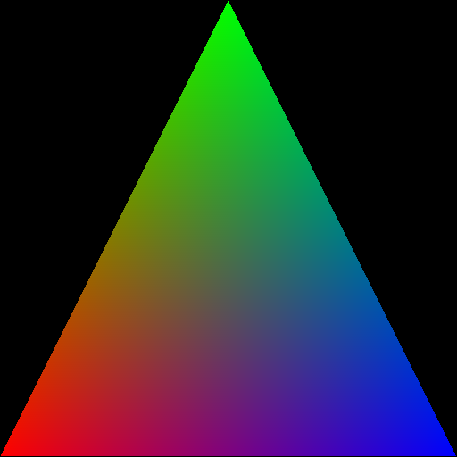

# DRTK - Differentiable Rendering Toolkit

This package is a PyTorch library that provides functionality for differentiable rasterization.

It consists of five main components

* **transform**
* **rasterize**
* **render**
* **interpolate**
* **edge_grad**

There are also optional components such as **msi** and **mipmap_grid_sampler**. New components may be added in the future.

Typical flow looks like this:

**transform** -> **rasterize** -> **render** -> **interpolate** -> **CUSTOM SHADING** -> **edge_grad**

where:
- **transform**: projects the vertex positions from camera space to image space
- **rasterize**: performs rasterization, where pixels in the output image are associated with triangles
- **render**: computes depth and baricentric image
- **interpolate**: interpolates arbitrary vertex attributes
- **CUSTOM SHADING**: user implemented shading.
- **edge_grad**: special module that computes gradients for the **rasterize** step which is not differentiable on its own. For details please see [**Rasterized Edge Gradients: Handling Discontinuities Differentiably**](https://arxiv.org/abs/2405.02508)

## Hellow Triangle
The "Hellow Triangle" with DRTK would look like this:
```python
import drtk
import torch as th
from torchvision.utils import save_image  # to save images

# create vertex buffer of shape [1 x n_vertices x 3], here for triangle `n_vertices` == 3
v = th.as_tensor([[[0, 511, 1], [255, 0, 1], [511, 511, 1]]]).float().cuda()

# create index buffer
vi = th.as_tensor([[0, 1, 2]]).int().cuda()

# rasterize
index_img = drtk.rasterize(v, vi, height=512, width=512)

# compute baricentrics
_, bary = drtk.render(v, vi, index_img)

# we won't do shading, we'll just save the baricentrics and filter out the empty region
# which is marked with `-1` in `index_img`
img = bary * (index_img != -1)

save_image(img, "render.png")
```



## Dependencies
* PyTorch >= 2.1.0

## Building

To build a wheel and install it:
```
pip install wheel
python setup.py  bdist_wheel
pip install dist/drtk-<wheel_name>.whl
```

To build inplace, which is useful for package development:
```
python setup.py build_ext --inplace -j 1
```

## Contributing

See the [CONTRIBUTING](CONTRIBUTING.md) file for how to help out.

## License
DRTK is CC-BY-NC 4.0 licensed, as found in the LICENSE file.

## Citation
```
@article{pidhorskyi2024rasterized,
  title={Rasterized Edge Gradients: Handling Discontinuities Differentiably},
  author={Pidhorskyi, Stanislav and Simon, Tomas and Schwartz, Gabriel and Wen, He and Sheikh, Yaser and Saragih, Jason},
  journal={arXiv preprint arXiv:2405.02508},
  year={2024}
}
```
